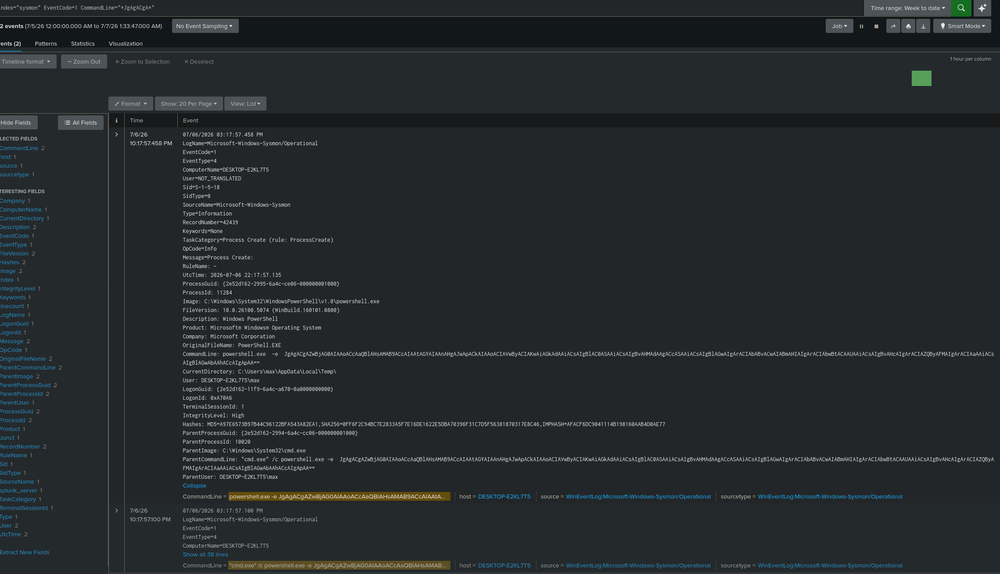

# Detection Notes

Atomic Red Team tests run against the Windows victim, with what Splunk actually caught.

## T1059.001 - Obfuscated PowerShell Detection (Atomic Test T1059.001-17)

### The test

Atomic Test T1059.001-17, "PowerShell Command Execution," runs PowerShell with a Base64 encoded command (`-e`/`-EncodedCommand`). Before running anything, I decoded the Base64 myself to check what it actually does. It just runs `Write-Host "Hello, from PowerShell!"`, built up piece by piece so the text does not appear plainly anywhere in the command. Confirmed it was harmless, then ran it for real.

### Finding it in Splunk

Searched Sysmon EventCode 1 (process creation) for a chunk of the encoded string in `CommandLine`:

```
index=sysmon EventCode=1 CommandLine="*JgAgACgA*"
```

Got two hits: `cmd.exe` launching `powershell.exe`, and the whole encoded blob sitting right there in `CommandLine`, fully readable to Splunk even though it looked obfuscated on screen.



### Why it matters

Obfuscation hides stuff from a person reading the terminal, not from Sysmon. A real detection does not search for "hello" in the command. It flags any process using `-e` or `-EncodedCommand` at all. Using encoding is the suspicious part, not whatever it decodes to.

### Next

Run a couple more T1059.001 tests, then move to a manual attack from Kali.
