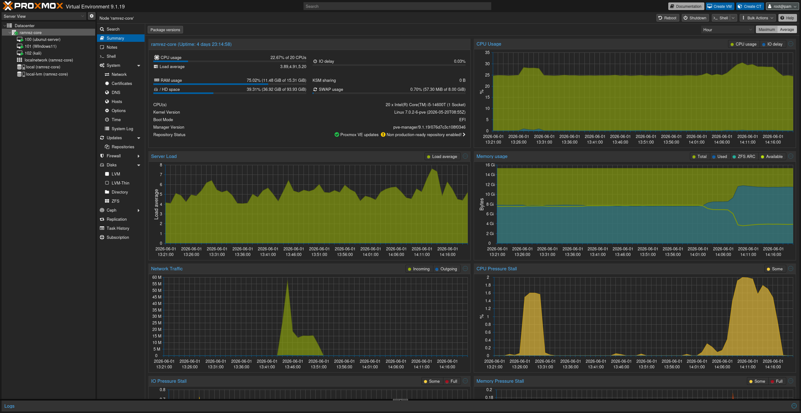
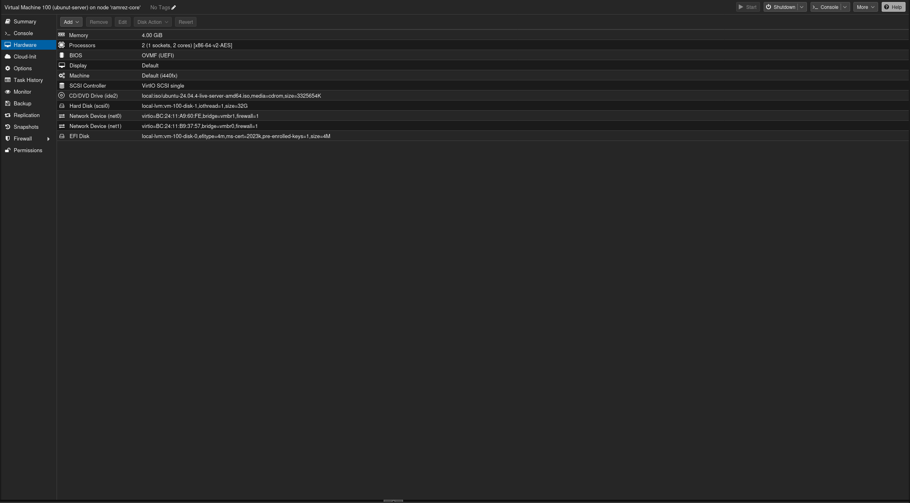
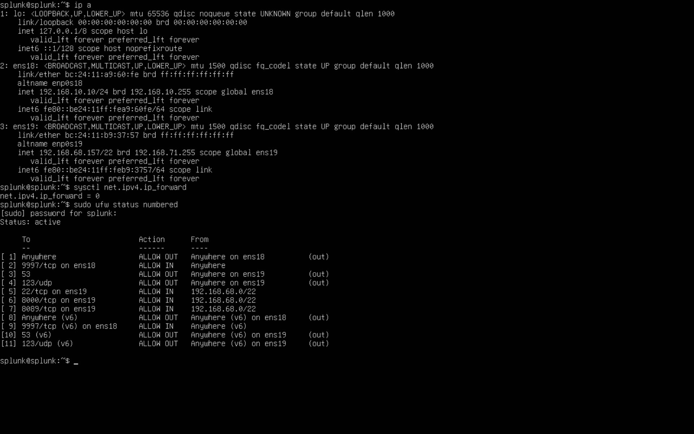
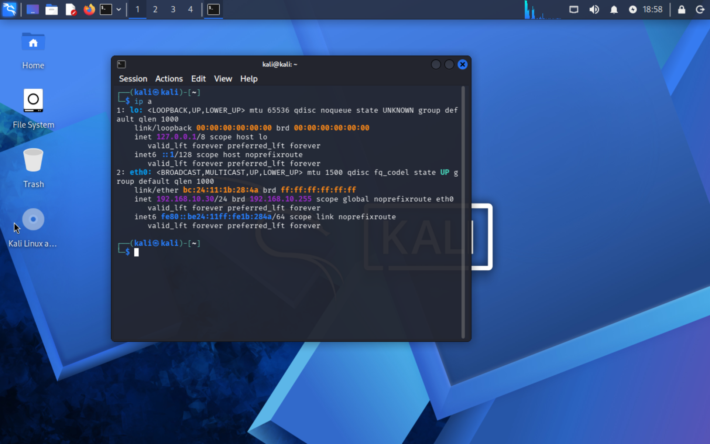
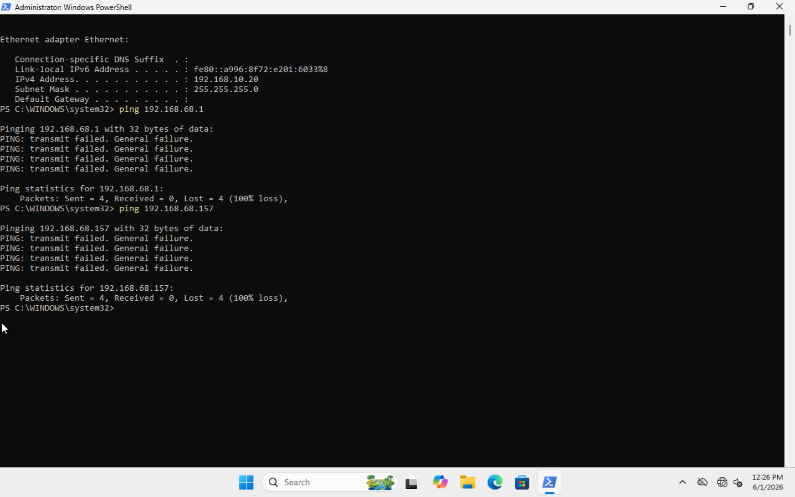
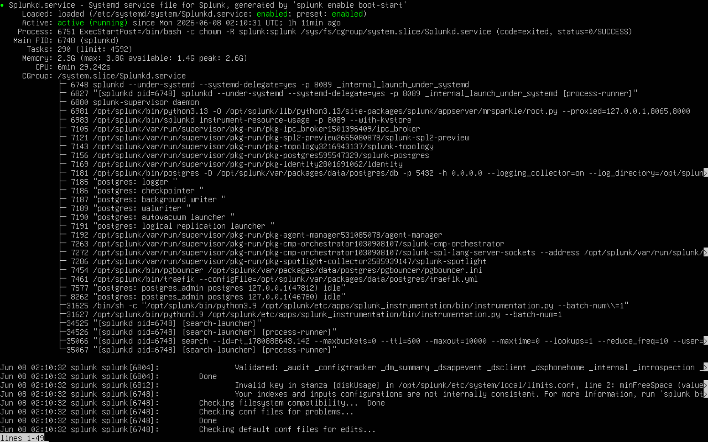
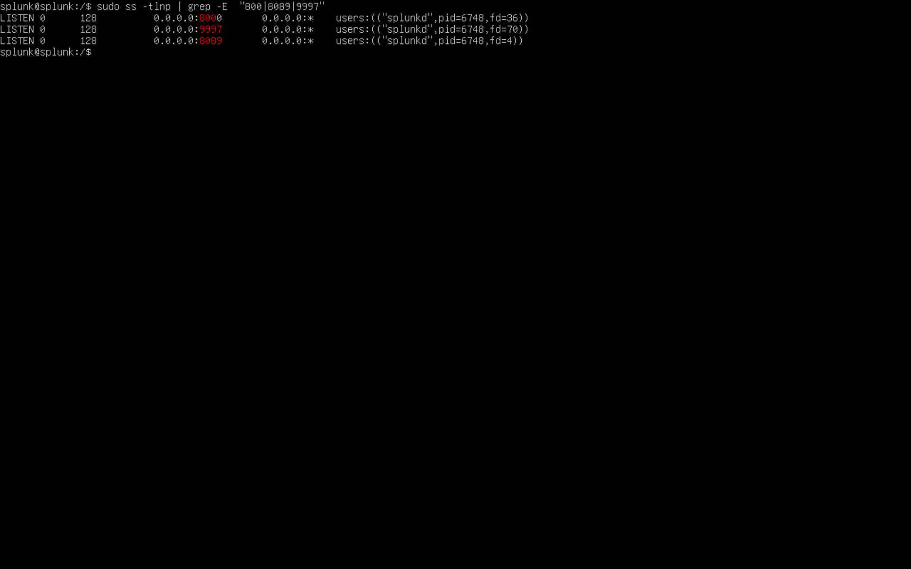
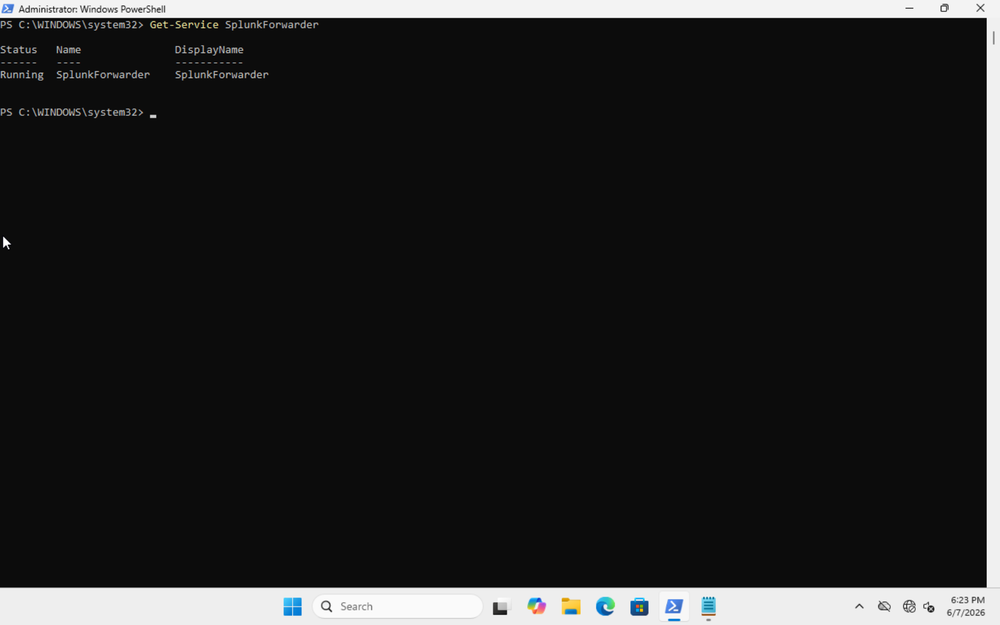
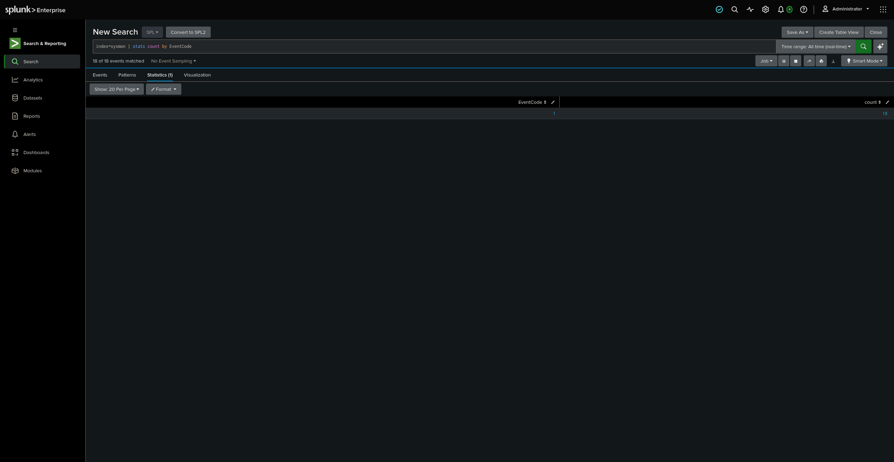

# Setup Notes

## Status

- The network and isolation are built and tested. They work.
- The Splunk pipeline is live. Sysmon events flow from the Windows victim into Splunk and I can search them.
- The detection layer and the LLM reporting tool are not built yet.
- Anything under Not done yet is not finished. I have not faked any results.

## Network Topology

I built an isolated lab on my Proxmox server (ramrez-core) using two bridges.

- vmbr0 is my home network, 192.168.68.0/22.
- vmbr1 is the isolated lab network, 192.168.10.0/24, with no gateway. The Windows 11 victim, the Ubuntu Splunk server, and the Kali attack box all live on vmbr1.

I deleted vmbr2. My old notes had Kali on vmbr2, but an attacker has to be on the same subnet as the target to reach it, so Kali is on vmbr1 with the victim now.

This is the Proxmox host with the lab VMs.

These are the bridges. vmbr0 has the home IP and gateway. vmbr1 has no gateway.

## Ubuntu Splunk Server

Ubuntu 24.04 LTS running Splunk 10.4.0. The server is dual homed. One leg is on the lab and one is on my home network, so I can open the dashboard from my desktop while the lab stays sealed off.

- Lab IP: 192.168.10.10 (ens18)
- Home IP: 192.168.68.157 (ens19)
- Username: splunk
- Splunk web UI: http://192.168.68.157:8000 (home side only)
- Runs as a dedicated splunk service account, not root, with systemd boot-start. Comes up on boot, no manual start needed.
- 20 character password set, HTTPS enabled on the web UI

UFW is set to deny all inbound and outbound by default. I only open what the lab actually needs.

- ens18 (lab side): only port 9997 inbound, the forwarder receiver. Nothing else.
- ens19 (home side): ports 8000, 22, and 8089 inbound, from my home network only.
- Outbound: only DNS (53) and NTP (123).

I also set net.ipv4.ip_forward to 0 so a compromised host cannot route through the server into my home network.

Here are both NICs in Proxmox. net0 is on vmbr1 (lab) and net1 is on vmbr0 (home).

Here is ip a, ip_forward set to 0, and the UFW rules on the server.

## Windows 11 VM

- OS: Windows 11 25H2
- Network: vmbr1, 192.168.10.20, no gateway (isolated)
- VirtIO drivers installed
- Local account, no Microsoft account
- Sysmon and the Universal Forwarder are running and forwarding to 192.168.10.10:9997. Details are in the Splunk Pipeline section below.

Here is the VM in Proxmox with its single NIC on vmbr1.

## Kali Linux VM

- OS: Kali 2026.1
- Network: vmbr1, 192.168.10.30, static, no gateway
- I verified the ISO SHA256 before installing
- This is my attack box, on the same subnet as the victim

Here is ip a on Kali showing 192.168.10.30.

## Isolation Testing

I tested the isolation from both sides.

From the Windows victim: it can reach the Splunk server at 192.168.10.10 but cannot reach my home network. Pinging 192.168.68.157 and the home gateway both fail with transmit failed, no route out.

From Kali: I ran a full nmap of the Splunk server. Ports 22, 8000, and 8089 came back filtered, so the firewall is dropping them. Out of all 65535 ports, only 9997 was reachable. From the attacker side the only thing on the dirty network is the log receiver.

I also confirmed Kali can see the victim at layer 2, since the victim MAC showed up in the ARP table. Ping to the victim fails only because Windows Firewall blocks ICMP by default, which is normal.

Note: I do not have screenshots saved for the Kali nmap scan or the Kali ARP table yet. I will add them when I re-run the scan after Splunk is started.

## Splunk Pipeline

This works now. Sysmon events flow from the Windows victim all the way into Splunk.

Done and verified:

- Splunk runs as a dedicated service account, not root, with systemd boot-start configured properly.
- Dropped Splunk's minimum free disk space guard from 5000MB to 500MB in server.conf. It was blocking every search until I did.
- Sysmon is running on the Windows VM and actively generating events.
- outputs.conf on the forwarder points to 192.168.10.10:9997.
- The Universal Forwarder service is running on Windows.

Here is the Splunk service on Ubuntu. Active, running as the splunk account, boot-start enabled.

Splunk listening on 8000, 8089, and 9997. Port 9997 is the forwarder receiver.

The forwarder service running on the Windows victim.

### inputs.conf on the forwarder

I created inputs.conf on the Windows Universal Forwarder to monitor the Sysmon event log channel. This took a lot of troubleshooting.

- PowerShell here-string syntax kept breaking because of the brackets in the stanza header.
- Notepad saved the file with a UTF-8 BOM, which made Splunk silently ignore the whole file. Fixed by saving as ANSI.
- Then I hit errorCode=5 access denied. The forwarder could not read the Sysmon channel. Fixed by switching the SplunkForwarder service to run as LocalSystem.

### Pipeline confirmed

index=sysmon | stats count by EventCode returns real Sysmon data with rich fields.

I also took snapshots of all three VMs (Splunk Ubuntu, Windows victim, Kali) as backups.

## Not done yet

- Sideload the Splunk Add-on for Sysmon. Egress is locked to 53 and 123 so I cannot pull it directly.
- Build the detection layer: MITRE ATT&CK mapping, Sigma rules, Atomic Red Team.
- Build the LLM reporting tool.
- Full review of the README.
